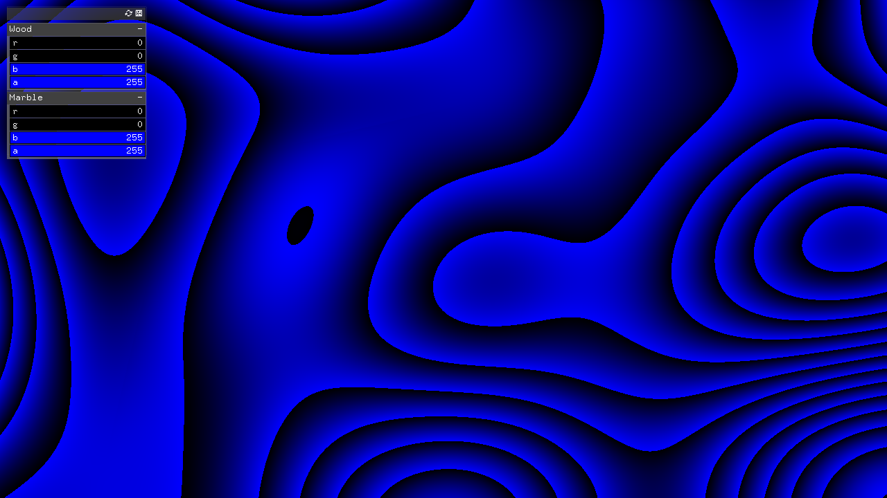

# Wall_PerlinTexture #

## 環境 ##
*	OS X El Capitan(10.11.6)
*	Xcode : 7.2
*	oF : 0.9.0

## add on ##
ofxGui  
ofxOsc  
ofxSyphon  
ofxXmlSettings  

## Contents ##
mouse pos/ MoCap posにより、perlin noiseの模様が変化する.  
さらに、unityにこの画像を送り、textureとして使用する。

  

## Device ##

## note ##

